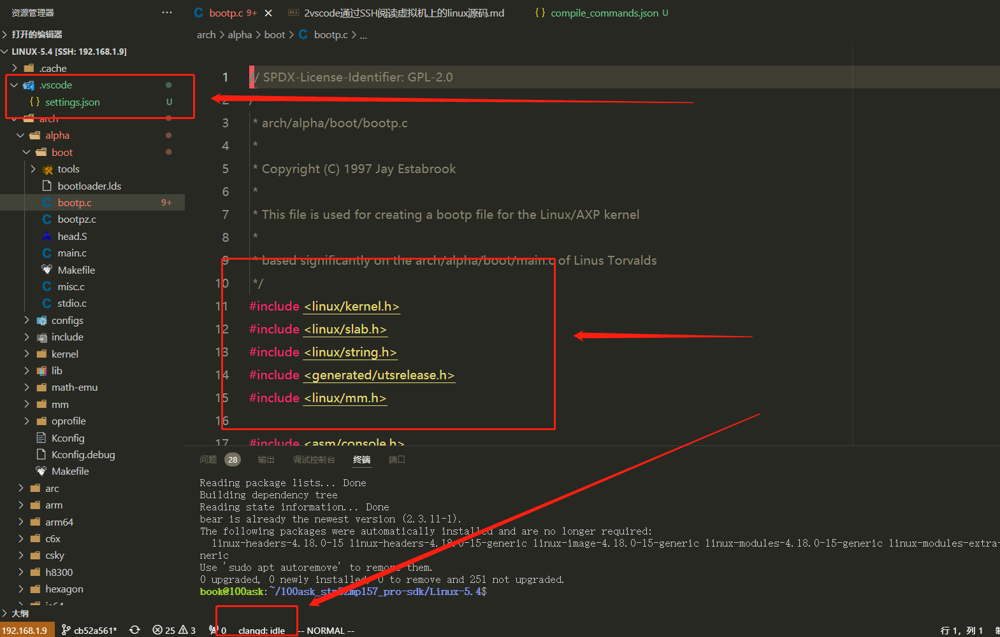

<!--
 * @Author: David
 * @Date: 2022-03-27 15:25:40
 * @LastEditors: David
 * @LastEditTime: 2022-03-27 18:05:28
 * @FilePath: \undefinedf:\weidonshang\笔记\linux-study\linux驱动学习\vscode通过SSH阅读在虚拟机上的linux的源码笔记\2vscode通过SSH阅读虚拟机上的linux源码.md
 * @Description: 
 * 
-->

## vscode通过SSH阅读在虚拟机上的linux的源码


    1.在vmware中运行ubuntu18.04虚拟机，安装openssh
    2.在windows中安装vscode    
    3.vscode安装 Remote - SSH ，确定linux的ip后，在vscode中，连接上远程ssh，打开linux-5.4
    4.编译linux源码 （make uImage LOADADDR=0xC2000040 <不同目标不一样>）
    5.sudo apt install bear 安装bear，该软件主要是用于Makefile工程，目的是给clangd生成依赖关系的配置文件(bear make uImage LOADADDR=0xC2000040 ，可以生成compile_commands.json文件) 
    5.运行 python ./scripts/gen_compile_commands.py (linux 自带)，它也会在根目录下生成compile_commands.json文件
    6.在https://github.com/clangd/clangd/releases，下载最近的稳定版本的服务程序 吗，目前是clangd-linux-13.0.0.zip
    7.在ubuntu18中，解压运行，然后找到运行目录，回到vscode在扩展设置里面的远程组的执行路径PATH填入/home/book/clangd_13.0.0/bin/clangd
    8.Arguments设置里面也可设置参数如：--compile-commands-dir=${workspaceFolder} --background-index --completion-style=detailed --header-insertion=never -log=info（未验证或许可以不加）
    9.在compile_commands.json文件生成的情况下此时clangd应该可以顺利运行，注意c/c++会冲突，关掉相关插件.
    10.下图表示了运行成功的样子，在打开.c文件中显示了clangd的状态，同时文件的头文件没有波浪，而是下划线代替了，按住ctrl然后鼠标点击就进去了，速度很快


## vscode的setting
    1.在工作区的根目录下建立.vscode文件夹，内部建立setting.json文件，通过配置文件设置参数
    2.从网上拷贝一些配置如下,改变了界面的设置，然后可以屏蔽显示或者搜索的文件夹
    3.还可以创建c_cpp_properties.json和其他文件，暂时没有配置
    4.其他可能遗漏看链接资料

## 链接资料
    clangd官方文档                                        https://clangd.llvm.org/
    使用VSCode进行linux内核代码阅读和开发：                 https://blog.csdn.net/xhnmdlfl/article/details/117911630
    搭建vscode阅读linux代码环境：                          https://blog.csdn.net/zf1575192187/article/details/108965806
    远程开发C++ Linux下如何打造C++完美开发IDE：clangd       https://www.bilibili.com/video/BV16g411N77i?from=search&seid=11456871286519104216&spm_id_from=333.337.0.0
    使用 clangd 取代 cpptools 作为 vscode 的 C/C++ LSP      
    https://www.cnblogs.com/zhcpku/p/15859554.html#:~:text=sudo%20apt%20install%20bear%20%E4%BD%BF%E7%94%A8%20bear%20%E7%94%9F%E6%88%90,compile_commands.json%20%E6%97%B6%EF%BC%8C%E5%8F%AA%E9%9C%80%E8%A6%81%E5%9C%A8%E5%8E%9F%E6%9C%AC%E7%9A%84%E7%BC%96%E8%AF%91%E5%91%BD%E4%BB%A4%E5%89%8D%E6%B7%BB%E5%8A%A0%20bear%20%E5%89%8D%E7%BC%80%E5%8D%B3%E5%8F%AF%EF%BC%8C%E5%A6%82%EF%BC%9A%20bear%20make%20-C%20src

## setting.json
```
{
    "editor.padding.top": 30,
    "editor.fontLigatures": false,
    "editor.lineHeight": 30,
    "editor.fontSize": 16,
    "editor.fontFamily": "'JetBrains Mono', Hack, 'PingFang SC Regular'",
    "editor.cursorBlinking": "expand",
    "editor.minimap.showSlider": "always",
    "editor.minimap.enabled": true,
    "editor.renderWhitespace": "selection",
    "editor.cursorSmoothCaretAnimation": true,
    "editor.wordWrap": "on",
    "editor.detectIndentation": true,
    "editor.insertSpaces": false,
    "editor.rulers": [
        {
            "column": 80,
            "color": "#ffffff10"
        },
    ],
    "editor.tokenColorCustomizations": {
        "[Monokai]": {
            "textMateRules": [
                {
                    "scope": "entity.name.type",
                    "settings": {
                        "foreground": "#FBDE4B",
                        "fontStyle": ""
                    }
                },
                {
                    "scope": "variable.other.global",
                    "settings": {
                        "foreground": "#ee57c8",
                        "fontStyle": ""
                    }
                },
                {
                    "scope": "entity.name.label",
                    "settings": {
                        "foreground": "#f1575c",
                        "fontStyle": ""
                    }
                },
                {
                    "scope": "variable.other.property",
                    "settings": {
                        "foreground": "#f1575c",
                        "fontStyle": ""
                    }
                },
                {
                    "scope": "variable.other.enummember",
                    "settings": {
                        "foreground": "#A6E22E",
                        "fontStyle": ""
                    }
                },
                {
                    "name": "Class/Constructor modifier",
                    "scope": [
                        "storage.type"
                    ],
                    "settings": {
                        "fontStyle": ""
                    }
                },
                {
                    "scope": "variable.parameter",
                    "settings": {
                        "fontStyle": ""
                    }
                }
            ]
        }
    },
    "search.showLineNumbers": true,
    "files.autoGuessEncoding": true,
    "files.associations": {
        "*.h": "c",
        "*.c": "c",
        "Kconfig": "kconfig"
    },
    "files.exclude": {
       "**/.o": true,
       "*.o": true,
    },

    "search.exclude": {
        "**/.o": true,
       "*.o": true,
    },

    "C_Cpp.updateChannel": "Insiders",
    "C_Cpp.inactiveRegionForegroundColor": "#ffffff",
    "C_Cpp.default.intelliSenseMode": "clang-x64",
    "C_Cpp.intelliSenseCacheSize": 20480,
    "C_Cpp.exclusionPolicy": "checkFilesAndFolders",
    "bracket-pair-colorizer-2.showBracketsInGutter": true,
    "bracket-pair-colorizer-2.showBracketsInRuler": false,
    "bracket-pair-colorizer-2.showHorizontalScopeLine": false,
    "bracket-pair-colorizer-2.highlightActiveScope": true,
    "bracket-pair-colorizer-2.activeScopeCSS": [
        "backgroundColor : {color}",
        "borderStyle : solid",
        "borderWidth : 0px",
        "opacity : 0.6"
    ],
    "workbench.colorCustomizations": {
        "[Monokai]": {
            "tab.inactiveBackground": "#272822",
            "tab.activeBorderTop": "#f1575c",
            "tab.border": "#272822",
            "editor.selectionHighlightBackground": "#f3e13b00",
            "editor.selectionBackground": "#ff990070",
            "editorCursor.foreground": "#f1575c",
            "statusBar.background": "#272822",
            "sideBar.background": "#272822",
            "titleBar.activeBackground": "#272822",
            "editorGroupHeader.tabsBackground": "#272822",
            "editorWidget.background": "#272822",
            "peekView.border": "#f1575c",
            "peekViewResult.background": "#272822",
            "peekViewTitle.background": "#272822",
            "editorHoverWidget.border": "#272822",
            "editorHoverWidget.background": "#30312a",
            "menu.background": "#272822"
        }
    },
    "workbench.activityBar.visible": true,
    "workbench.startupEditor": "newUntitledFile",
    "workbench.sideBar.location": "left",
    "workbench.colorTheme": "Monokai",
    "[markdown]": {
        "editor.wordWrap": "bounded"
    },
    "[python]": {
        "editor.tabSize": 4,
        "editor.insertSpaces": true
    },
    "explorer.confirmDelete": false,
    "git.enableSmartCommit": true,
    "git.confirmSync": false,
    "window.zoomLevel": 1,
    "breadcrumbs.enabled": true,
    "telemetry.enableTelemetry": false,
    "terminal.integrated.rendererType": "dom",
    "tabnine.experimentalAutoImports": true,
    "editor.largeFileOptimizations": false,
    "http.proxySupport": "off",
    "workbench.editor.enablePreview": true,
}
```
